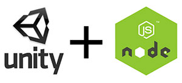

# socket.io-unity



Socket.IO Client Library for Unity (mono / .NET 2.0), which is ported from the [JavaScript client](https://github.com/Automattic/socket.io-client) version [1.1.0](https://github.com/socketio/socket.io-client/releases/tag/1.1.0).

[SocketIoClientDotNet](https://github.com/Quobject/SocketIoClientDotNet) by Quobject is a very good project, but it does not support Unity. So I spent a few overnights to port it to mono/.NET 2.0.

Now game developers can:
* use node.js to develop game server, enjoy the powerful ecosystem of network and database, easily deploy to cloud;
* use Unity to develop game client, enjoy the poweful game engine and IDE.
* use websocket / socket.io to communicate between server/client.

## Installation

Downlaod socket.io.unitypackage and then import into Unity.

Or, only download the following files in Lib and put to Unity project:
* WebSocket4Net.dll
* SocketIoClientDotNet.dll
* Newtonsoft.Json.dll

It's available on [Unity Asset Store](https://www.assetstore.unity3d.com/en/#!/content/92068) for $10, but you can also download it for FREE here.

If you are interested to dig into the source code, welcome to fork the [SocketIoClientDotNet for .NET 2.0](https://github.com/floatinghotpot/SocketIoClientDotNet/tree/net20).

## Usage
socket.io client for Unity has a similar api to those of the [JavaScript client](https://github.com/Automattic/socket.io-client).

```cs
using Quobject.SocketIoClientDotNet.Client;

var socket = IO.Socket("http://localhost:3000");
socket.On(Socket.EVENT_CONNECT, () =>
{
  socket.Emit("hi");
});
socket.On("hi", (data) =>
{
  Debug.Log(data);
  socket.Disconnect();
});
```

And, with Newtonsoft.Json.dll, we can easliy serialize / deserialize json object. Read more about [Newtonsoft.Json](http://www.newtonsoft.com/json).

## Features
This library supports all of the features the JS client does, including events, options and upgrading transport.

## Framework Versions
Mono, .NET 2.0

## Demo
* [node.js example code, chat server](Demo/test-server/index.js)
* [HTML example code, web-based chat client](Demo/test-server/index.html)
* [Unity C# example code, chat client](Demo/SocketIOScript.cs)

## Comparison

Project | Author | Popularity | Status
---|---|---|---
[socket.io-unity](https://github.com/floatinghotpot/socket.io-unity) | floatinghotpot | new | ACTIVE, support .NET 2.0 and Unity
[SocketIoClientDotNet](https://github.com/Quobject/SocketIoClientDotNet) | Quobject | 323 stars | ACTIVE, support .NET 3.5 and higher, but not compatible with .NET 2.0 and Unity
[UnitySocketIO](https://github.com/NetEase/UnitySocketIO) | NetEase | 547 stars | no longer maintained, not compatible with socket.io 1.x and later
[unity-socket.io-DEPRECATED](https://github.com/fpanettieri/unity-socket.io-DEPRECATED) | fpanettieri | 189 stars | no longer maintained
[UnitySocketIO-WebSocketSharp](https://github.com/kaistseo/UnitySocketIO-WebSocketSharp) | kaistseo | 108 stars | no longer maintained

## Credit

Thanks to the authors of following projects:
* [SocketIoClientDotNet](https://github.com/Quobject/SocketIoClientDotNet) by Quobject, a Socket.IO Client Library for C#
* [WebSocket4Net](https://github.com/kerryjiang/WebSocket4Net) by Kerry Jiang, a .NET websocket client implementation.
* [Newtonsoft.Json](https://github.com/JamesNK/Newtonsoft.Json) by JamesNK, a popular high-performance JSON framework for .NET
